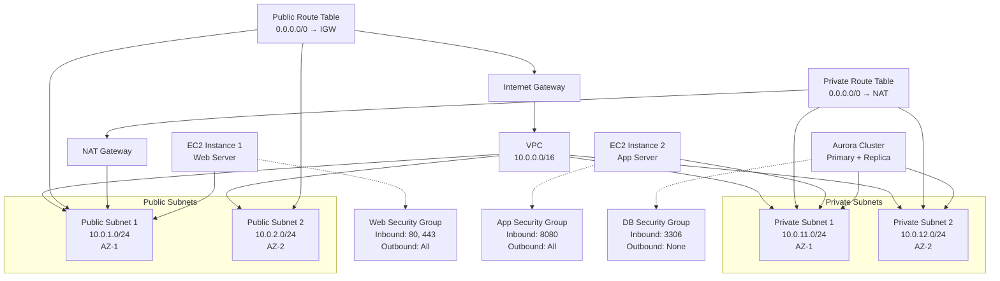

 VPC Architecture

```mermaid
graph TB
    VPC[VPC<br/>10.0.0.0/16]

    subgraph Public Subnets
        PubSub1[Public Subnet 1<br/>10.0.1.0/24<br/>AZ-1]
        PubSub2[Public Subnet 2<br/>10.0.2.0/24<br/>AZ-2]
    end

    subgraph Private Subnets
        PrivSub1[Private Subnet 1<br/>10.0.11.0/24<br/>AZ-1]
        PrivSub2[Private Subnet 2<br/>10.0.12.0/24<br/>AZ-2]
    end

    IGW[Internet Gateway]
    NAT[NAT Gateway]

    PubRT[Public Route Table<br/>0.0.0.0/0 → IGW]
    PrivRT[Private Route Table<br/>0.0.0.0/0 → NAT]

    WebSG[Web Security Group<br/>Inbound: 80, 443<br/>Outbound: All]
    AppSG[App Security Group<br/>Inbound: 8080<br/>Outbound: All]
    DBSG[DB Security Group<br/>Inbound: 3306<br/>Outbound: None]

    EC2_1[EC2 Instance 1<br/>Web Server]
    EC2_2[EC2 Instance 2<br/>App Server]

    Aurora[Aurora Cluster<br/>Primary + Replica]

    VPC --> PubSub1
    VPC --> PubSub2
    VPC --> PrivSub1
    VPC --> PrivSub2

    IGW --> VPC
    PubRT --> PubSub1
    PubRT --> PubSub2
    PubRT --> IGW

    NAT --> PubSub1
    PrivRT --> PrivSub1
    PrivRT --> PrivSub2
    PrivRT --> NAT

    EC2_1 --> PubSub1
    EC2_1 -.-> WebSG

    EC2_2 --> PrivSub1
    EC2_2 -.-> AppSG

    Aurora --> PrivSub1
    Aurora --> PrivSub2
    Aurora -.-> DBSG
```
